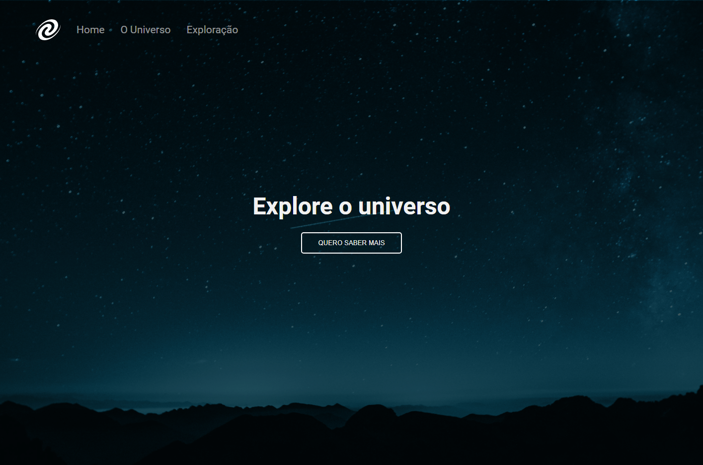

<h1 align="center"> Explorer Universe </h1>

  

 

  

## 🚀 Tecnologias

Esse projeto foi desenvolvido com as seguintes tecnologias:

- HTML e CSS
- JavaScript

## 💻 Projeto

Nesse projeto utilizei javaScript puro para fazer uma SPA (Single page application)

 <h3 align="center"> Developed by <a href="https://www.linkedin.com/in/gabriel-santos-bb4a10188/">Gabriel Santos</a> ☕</h3>
